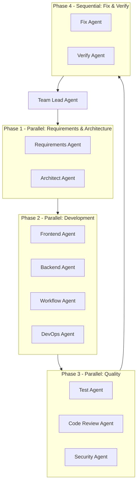
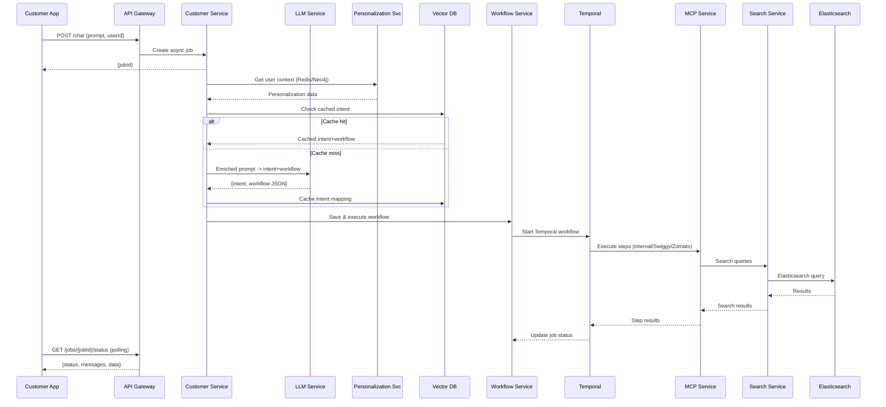

# Food Bot 2 - Claude Multi-Agent Development Platform

## 1. Project Structure (Monorepo with npm workspaces)

```
food-bot-2/
├── CLAUDE.md                          # Master orchestration instructions
├── .claude/
│   ├── settings.json                  # Claude Code settings
│   ├── project-management/            # All requirements, architecture, task docs
│   │   ├── ARCHITECTURE.md
│   │   ├── REQUIREMENTS.md
│   │   ├── TASK-BREAKDOWN.md
│   │   ├── TEST-PLAN.md
│   │   ├── customer-app/
│   │   ├── restaurant-app/
│   │   ├── backend/
│   │   ├── workflow-engine/
│   │   ├── mcp-layer/
│   │   └── infrastructure/
│   └── agents/                        # Agent team definitions
│       ├── AGENT-TEAM.md              # Team structure & coordination rules
│       ├── architect-agent.md
│       ├── requirements-agent.md
│       ├── frontend-agent.md
│       ├── backend-agent.md
│       ├── workflow-agent.md
│       ├── test-agent.md
│       ├── review-agent.md
│       ├── security-agent.md
│       └── devops-agent.md
├── apps/
│   ├── customer-app/                  # Capacitor + React (Vite)
│   ├── restaurant-app/                # Capacitor + React (Vite)
│   └── chrome-extension/              # Browser-based workflow executor
├── backend/
│   ├── api-gateway/                   # NestJS - API gateway + auth
│   ├── customer-service/              # NestJS - Customer domain
│   ├── restaurant-service/            # NestJS - Restaurant domain
│   ├── order-service/                 # NestJS - Order management
│   ├── workflow-service/              # NestJS - Workflow orchestration
│   ├── search-service/                # NestJS - Elasticsearch integration
│   ├── llm-service/                   # NestJS - LLM abstraction (Claude/OpenAI/Gemini)
│   ├── mcp-service/                   # NestJS - MCP aggregation layer
│   ├── personalization-service/       # NestJS - Redis/GraphDB user context
│   └── shared/                        # Shared DTOs, interfaces, utils
├── packages/
│   ├── types/                         # Shared TypeScript types
│   ├── ui-kit/                        # Shared React component library
│   └── mcp-client/                    # MCP client SDK
├── temporal/
│   ├── workflows/                     # Temporal workflow definitions
│   └── activities/                    # Temporal activity implementations
├── mocks/
│   ├── swiggy-mcp/                    # Mock Swiggy MCP server
│   ├── zomato-mcp/                    # Mock Zomato MCP server
│   └── ondc-mcp/                      # Mock ONDC MCP server
├── infrastructure/
│   ├── docker-compose.yml             # Full stack: Postgres, Redis, ES, Kafka, Temporal, Neo4j, Qdrant
│   ├── docker-compose.dev.yml
│   └── k8s/                           # Optional K8s manifests
├── scripts/
│   ├── orchestrate.sh                 # Launch Claude agent teams
│   ├── setup-infra.sh                 # Start Docker infrastructure
│   └── seed-data.sh                   # Seed test data
├── package.json                       # Root workspace config
├── turbo.json                         # Turborepo pipeline config
├── tsconfig.base.json
├── .env.example
└── README.md
```

## 2. Claude Multi-Agent Orchestration Architecture

### Agent Team Structure



### Agent Definitions

| Agent | Role | Parallel Group | Key Responsibilities |

|-------|------|---------------|---------------------|

| **Team Lead** | Orchestrator | - | Coordinate all agents, manage task list, resolve conflicts |

| **Requirements Agent** | Analyst | Phase 1 | Expand high-level requirements into detailed specs per domain |

| **Architect Agent** | Design | Phase 1 | System architecture, data models, API contracts, tech decisions |

| **Frontend Agent** | Developer | Phase 2 | Both customer-app and restaurant-app with rich chatbot UI |

| **Backend Agent** | Developer | Phase 2 | All NestJS microservices, DB schemas, API implementations |

| **Workflow Agent** | Developer | Phase 2 | Temporal workflows, MCP integrations, browser executor, agent SDK integrations |

| **DevOps Agent** | Infra | Phase 2 | Docker, CI/CD, infrastructure configs, mock MCP servers |

| **Test Agent** | QA | Phase 3 | Generate & run unit/integration/e2e tests |

| **Review Agent** | Quality | Phase 3 | Code review, static analysis, code quality checks |

| **Security Agent** | Security | Phase 3 | SAST/DAST, dependency audit, secrets scanning, auth review |

### CLAUDE.md Orchestration Rules

The master `CLAUDE.md` will define:

- **Environment variables**: `CLAUDE_CODE_EXPERIMENTAL_AGENT_TEAMS=1`
- **Routing rules**: Which tasks go parallel vs sequential
- **File ownership**: Each agent owns specific directories (no file conflicts)
- **Shared task list format**: JSON-based task board with status tracking
- **Dependency graph**: Task prerequisites and handoff protocols
- **LLM config**: Which model (Claude/OpenAI/Gemini) to use where, with on/off toggles via `.env`

## 3. Application Architecture

### Data Flow



### Key Technology Choices

- **Frontend**: React 18 + Vite + Capacitor v8 + TailwindCSS + Framer Motion
- **UI Kit**: Custom rich chat components (cards with image+text+attributes, CTA buttons, input fields, calendars, filters, weekly editable plan)
- **Backend**: NestJS v10 + TypeORM + class-validator
- **Databases**: PostgreSQL (primary), Redis (cache + sessions), Neo4j (user preference graph), Qdrant (vector DB), Elasticsearch (search)
- **Messaging**: Kafka (event streaming, ES indexing pipeline)
- **Workflow**: Temporal (primary), with fallback to agent SDK (Claude/OpenAI/Gemini) and browser-based execution
- **MCP Layer**: Internal restaurant MCP + Swiggy MCP (`https://mcp.swiggy.com/food`) + Zomato MCP (`https://mcp-server.zomato.com/mcp`) + Mock servers for Swiggy, Zomato, ONDC
- **LLM**: Claude API (primary reasoning), OpenAI (embeddings + fallback), Gemini (multimodal + browser DOM analysis)

### LLM Configuration Model

```typescript
// config/llm.config.ts
interface LLMConfig {
  claude: {
    enabled: boolean;
    apiKey: string;
    model: string;
    usages: ['intent', 'workflow', 'reasoning'];
  };
  openai: { enabled: boolean; apiKey: string; model: string; usages: ['embeddings', 'fallback'] };
  gemini: {
    enabled: boolean;
    apiKey: string;
    model: string;
    usages: ['multimodal', 'dom-analysis'];
  };
}
```

### MCP Integration Model

```typescript
// config/mcp.config.ts
interface MCPConfig {
  internal: { enabled: boolean; url: string };
  swiggy: { enabled: boolean; url: string; mock: boolean };
  zomato: { enabled: boolean; url: string; mock: boolean };
  ondc: { enabled: boolean; url: string; mock: boolean };
}
```

### Workflow Execution Strategy

The system selects execution engine based on capability:

- **Backend API available** (internal/ONDC with API keys) -> Temporal workflow calls APIs directly
- **MCP available** (Swiggy/Zomato MCP endpoints) -> Agent SDK (Claude/OpenAI/Gemini with MCP client) executes via MCP
- **No API/MCP** (need browser interaction) -> Chrome extension or OpenClaw-like browser automation polls workflow JSON from backend and executes client-side, using a small bundled model (Gemini Nano) for DOM analysis

### User Preference Graph (Neo4j)

```
User -> DayOfWeek -> HourOfDay -> Category -> SubCategory -> Restaurant -> Dish
```

Each edge has a weight/score based on order history, recency, frequency.

## 4. Key Feature Modules

### Customer App Features

- Rich chatbot UI with message types: text, card (image+text+attrs), carousel, CTA buttons, input fields, date pickers, address selector, cart summary, order tracker, calendar planner
- Job polling with progressive status updates
- Party planner flow (budget, headcount, veg/non-veg, multi-restaurant, future scheduling)
- Diet planner flow (weekly calendar, meal slots, health goals, skip/edit per meal, multi-address)
- Standard ordering: search, filter, cart, checkout, payment, tracking, feedback
- Customer login & signup flow

### Restaurant App Features

- Restaurant onboarding wizard (Name, Contact, Photo, Type, Address with lat long, KYC, FASSAI, Contract with commercial, digital signature, Approval flow, Menu Upload)
- Menu management (CRUD, availability toggle, smart suggestions)
- Order list with status updates
- Analytics dashboard (revenue, popular items, ratings)
- Marketing campaign management, user segment selection or creation, content creation using llm, smart scheduling, campaign on / off, campaign performance
- AI-powered insights via natural language queries

### Backend Services

- **api-gateway**: Auth (JWT), rate limiting, request routing
- **customer-service**: Chat/job management, user profiles, addresses, feedback
- **restaurant-service**: Onboarding, menu CRUD, restaurant profiles
- **order-service**: Cart, checkout, payment, order lifecycle, tracking
- **workflow-service**: Workflow storage, Temporal integration, status updates
- **search-service**: ES indexing via Kafka, search/filter APIs
- **llm-service**: Multi-LLM abstraction with circuit breaker, token optimization
- **mcp-service**: MCP routing (internal/Swiggy/Zomato/ONDC) based on config
- **personalization-service**: User preference graph (Neo4j), context enrichment (Redis)

## 5. Execution Plan for Claude Agent Teams

### Phase 1: Requirements & Architecture (Parallel)

- **Requirements Agent**: Expand each domain (customer, restaurant, order, workflow, MCP, search, LLM, personalization) into detailed functional requirements with acceptance criteria. Output to `.claude/project-management/REQUIREMENTS.md` and per-domain docs.
- **Architect Agent**: Create system architecture, data models (ERD, graph schema, ES mappings), API contracts (OpenAPI specs), sequence diagrams, deployment architecture. Output to `.claude/project-management/ARCHITECTURE.md`.

### Phase 2: Task Planning & Test Cases (Parallel after Phase 1)

- **Requirements Agent**: Break requirements into granular dev tasks with estimates, dependencies, and agent assignments. Output to `.claude/project-management/TASK-BREAKDOWN.md`.
- **Test Agent**: Generate test cases (unit, integration, e2e) from requirements. Output to `.claude/project-management/TEST-PLAN.md`.

### Phase 3: Development (Parallel, 4 agents)

- **Frontend Agent**: Build customer-app and restaurant-app with all UI components, pages, state management (Zustand), API clients, Capacitor plugins.
- **Backend Agent**: Build all NestJS microservices, database migrations, API implementations, Kafka producers/consumers.
- **Workflow Agent**: Build Temporal workflows, MCP client integrations, agent SDK wrappers, chrome extension for browser-based execution, mock MCP servers.
- **DevOps Agent**: Docker Compose, CI pipelines, env configs, seed scripts, infrastructure setup.

### Phase 4: Quality Assurance (Parallel, 3 agents)

- **Test Agent**: Execute all test suites, report failures.
- **Review Agent**: Code review all generated code, check patterns, lint, static analysis (sonar).
- **Security Agent**: Run SAST (ESLint security plugins, Snyk), check auth flows, input validation, secrets management, dependency vulnerabilities.

### Phase 5: Fix & Verify (Sequential)

- Fix all test failures, code review issues, security vulnerabilities.
- Re-run all tests and audits.
- Update documentation.

### Phase 6: Finalize

- Update `README.md` with project overview and links to all docs in `.claude/project-management/`.
- Final integration test pass.

## 6. What Gets Created in This Initial Setup

When the plan is confirmed, I will create:

1. **`CLAUDE.md`** - Master orchestration file with agent team instructions, routing rules, file ownership, and execution phases
2. **`.claude/agents/*.md`** - All 9 agent definition files with detailed roles, capabilities, file ownership, and task templates
3. **`.claude/project-management/`** - Initial skeleton docs that agents will expand
4. **Project scaffold** - `package.json` (workspaces), `turbo.json`, `tsconfig.base.json`, `.env.example`, all app/service directory stubs with their own `package.json` files
5. **`infrastructure/docker-compose.yml`** - Full infra stack (Postgres, Redis, Neo4j, Qdrant, Elasticsearch, Kafka, Temporal)
6. **`scripts/orchestrate.sh`** - Script to launch the Claude agent team pipeline
7. **`mocks/`** - Mock MCP server stubs for Swiggy, Zomato, ONDC
8. **`README.md`** - Project overview with links to all documentation
